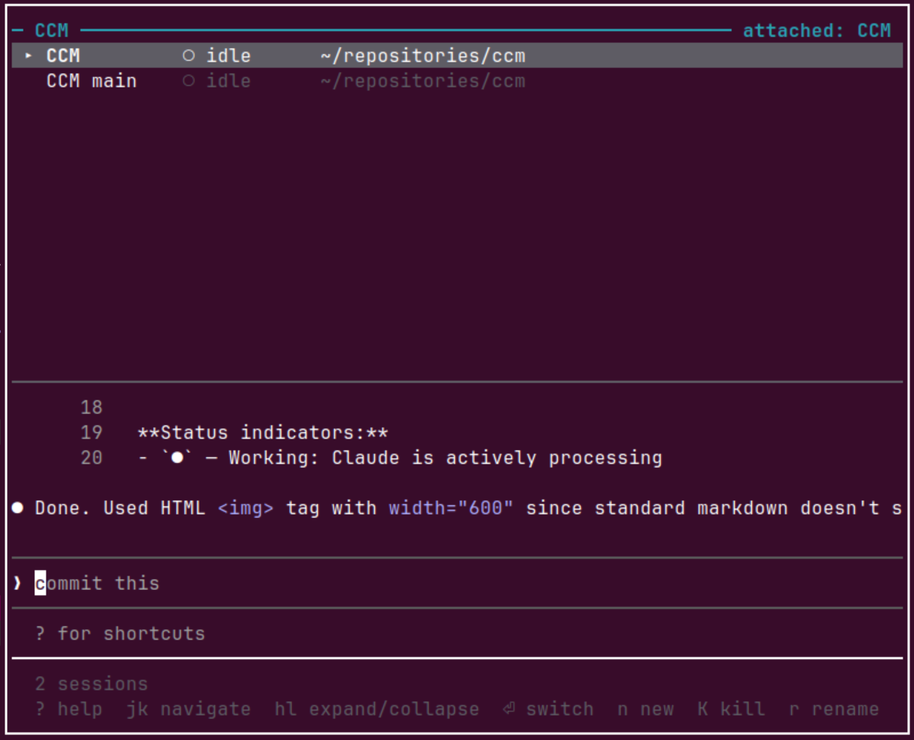
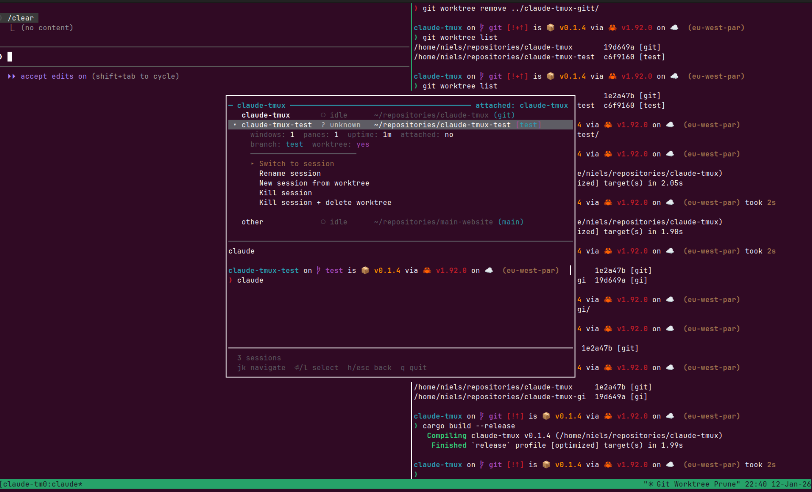

# claude-tmux

A terminal user interface for managing multiple Claude Code sessions within tmux. claude-tmux provides a centralized view of all your Claude Code instances, enabling quick switching, status monitoring, and session lifecycle management.

## Installation

### Cargo install

Just run:

```bash
cargo install claude-tmux
```

Add the following line to your `~/.tmux.conf`:

```bash
bind-key C-c display-popup -E -w 80 -h 30 "~/.cargo/bin/claude-tmux"
```

Reload your tmux configuration.
Press `Ctrl-b, Ctrl-c` to open claude-tmux from any tmux session.

### Build from source

```bash
git clone https://github.com/nielsgroen/claude-tmux.git
cd claude-tmux
cargo build --release
```

Add this to your `~/.tmux.conf` to bind claude-tmux to a key:

```bash
bind-key C-c display-popup -E -w 80 -h 30 "/path/to/claude-tmux"
```

Reload your tmux configuration.
Press `Ctrl-b, Ctrl-c` to open claude-tmux from any tmux session.

### Tmux options

Options:
- `-E` — Close popup when claude-tmux exits
- `-w 80 -h 30` — Popup dimensions (adjust to preference)

## Features

- **Session Overview** — See all tmux sessions at a glance with Claude Code status indicators
- **Status Detection** — Know whether each Claude Code instance is idle, working, or waiting for input
- **Quick Switching** — Jump to any session with minimal keystrokes
- **Live Preview** — See the last lines of the selected session's Claude Code pane with full ANSI color support
- **Session Management** — Create, kill, and rename sessions without leaving the TUI
- **Expandable Details** — View metadata like window count, pane commands, uptime, and attachment status
- **Fuzzy Filtering** — Quickly filter sessions by name or path

## Screenshots

View the screenshots at [GitHub](https://github.com/nielsgroen/claude-tmux).





**Status indicators:**
- `●` — Working: Claude is actively processing
- `○` — Idle: Ready for input
- `◐` — Waiting for input: Permission prompt (`[y/n]`)
- `?` — Unknown: Not a Claude Code session or status unclear

## Keybindings

### Navigation

| Key | Action |
|-----|--------|
| `j` / `↓` | Move selection down |
| `k` / `↑` | Move selection up |
| `l` / `→` | Expand session details |
| `h` / `←` | Collapse session details |
| `Enter` | Switch to selected session |

### Actions

| Key | Action |
|-----|--------|
| `n` | Create new session |
| `K` | Kill selected session (with confirmation) |
| `r` | Rename selected session |
| `/` | Filter sessions by name/path |
| `Ctrl+c` | Clear filter |
| `R` | Refresh session list |

### Other

| Key | Action |
|-----|--------|
| `?` | Show help |
| `q` / `Esc` | Quit |

## Status Detection

claude-tmux detects Claude Code status by analyzing pane content:

| Pattern | Status |
|---------|--------|
| Input prompt (`❯`) with border above + "ctrl+c to interrupt" | Working |
| Input prompt (`❯`) with border above, no interrupt message | Idle |
| Contains `[y/n]` or `[Y/n]` | Waiting for input |
| Otherwise | Unknown |

## Session Model

claude-tmux identifies sessions containing Claude Code by looking for panes running the `claude` command. The displayed working directory and preview come from the Claude Code pane when present, otherwise from the first pane.

Sessions are sorted with attached sessions first, then alphabetically by name.

## Dependencies

- [ratatui](https://ratatui.rs/) — Terminal UI framework
- [crossterm](https://github.com/crossterm-rs/crossterm) — Terminal manipulation
- [ansi-to-tui](https://github.com/uttarayan21/ansi-to-tui) — ANSI escape sequence rendering
- [anyhow](https://github.com/dtolnay/anyhow) — Error handling
- [dirs](https://github.com/dirs-dev/dirs-rs) — Home directory resolution
- [unicode-width](https://github.com/unicode-rs/unicode-width) — Text alignment

## Project Structure

```
claude-tmux/
├── Cargo.toml
├── src/
│   ├── main.rs        # Entry point, terminal setup
│   ├── app.rs         # Application state machine
│   ├── ui.rs          # Ratatui rendering
│   ├── tmux.rs        # tmux command wrapper
│   ├── session.rs     # Session/Pane data structures
│   ├── detection.rs   # Claude Code status detection
│   └── input.rs       # Keyboard event handling
└── README.md
```
